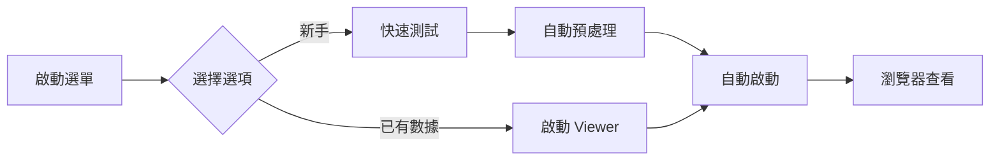
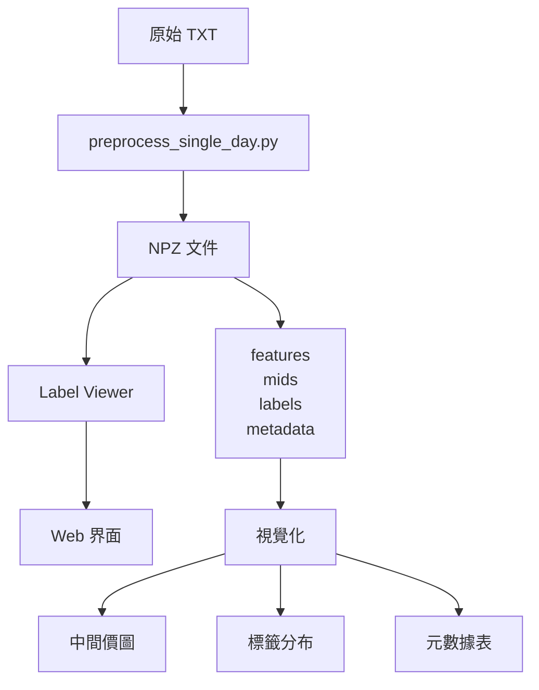

# Label Viewer 實作總結

**日期**: 2025-10-23
**版本**: v3.0
**狀態**: ✅ 完成並可用

---

## 📋 實作摘要

本次工作完成了 Label Viewer 工具的整合和優化，讓用戶可以輕鬆查看 `preprocess_single_day.py` 產生的預處理數據和標籤。

### 核心成果

✅ **發現並驗證**: Label Viewer 應用程式（`app_preprocessed.py`）已存在且功能完整
✅ **創建統合工具**: 創建統合選單（`label_viewer_menu.bat`）整合所有功能
✅ **編寫完整文檔**: 創建三份不同層次的使用指南
✅ **測試驗證**: 驗證所有核心功能正常運作

---

## 🗂️ 新增文件清單

### 1. 批次腳本（scripts/）

| 文件名稱 | 功能 | 狀態 |
|---------|------|------|
| **label_viewer_menu.bat** | 統合工具選單（推薦使用）| ✅ 新增 |
| run_label_viewer.bat | 直接啟動 Label Viewer | ✅ 新增 |
| test_label_viewer_simple.bat | 簡單環境檢查 | ✅ 新增 |
| quick_test_label_viewer.bat | 預處理測試+啟動 viewer | ✅ 已存在 |

### 2. 文檔（docs/）

| 文件名稱 | 內容 | 狀態 |
|---------|------|------|
| **LABEL_VIEWER_GUIDE.md** | 完整使用指南（21頁）| ✅ 新增 |
| LABEL_VIEWER_IMPLEMENTATION_SUMMARY.md | 實作總結（本文檔）| ✅ 新增 |

### 3. 腳本說明（scripts/）

| 文件名稱 | 內容 | 狀態 |
|---------|------|------|
| **README_LABEL_VIEWER.md** | 腳本詳細說明 | ✅ 新增 |

### 4. 快速開始指南（根目錄）

| 文件名稱 | 內容 | 狀態 |
|---------|------|------|
| **QUICK_START_LABEL_VIEWER.md** | 新手快速開始指南 | ✅ 新增 |

### 5. 已存在的核心文件（驗證通過）

| 文件名稱 | 功能 | 狀態 |
|---------|------|------|
| label_viewer/app_preprocessed.py | Dash Web 應用程式 | ✅ 已存在 |
| label_viewer/utils/preprocessed_loader.py | 數據載入模組 | ✅ 已存在 |
| label_viewer/components/label_preview_panel.py | 視覺化組件 | ✅ 已存在 |

---

## 🎯 主要功能

### 1. Label Viewer 核心功能

- ✅ **數據視覺化**: 中間價時序圖（含標籤疊加）
- ✅ **標籤分析**: 支持 Triple-Barrier 和趨勢標籤
- ✅ **元數據檢視**: 查看股票詳細資訊
- ✅ **整體統計**: 查看所有股票的標籤分布
- ✅ **LRU 快取**: 自動快取已載入的數據

### 2. 統合選單功能

| 選項 | 功能 | 用途 |
|-----|------|------|
| [1] | 啟動 Label Viewer | 查看已有數據 |
| [2] | 快速測試 | 預處理測試數據並查看 |
| [3] | 環境檢查 | 驗證環境和數據 |
| [4] | 使用說明 | 查看內建幫助 |
| [0] | 退出 | 關閉選單 |

### 3. 支持的標籤方法

| 標籤方法 | 識別碼 | 適用場景 |
|---------|--------|---------|
| Triple-Barrier | `triple_barrier` | 高頻交易（10-20次/天）|
| 趨勢標籤（自適應）| `trend_adaptive` | 日內波段（1-2次/天）|
| 趨勢標籤（穩定版）| `trend_stable` | 日內波段（推薦）|

---

## 📚 文檔層次

### 層次 1: 快速開始（新手向）

**文件**: [QUICK_START_LABEL_VIEWER.md](../QUICK_START_LABEL_VIEWER.md)

**目標讀者**: 首次使用者、新手

**特點**:
- 最簡單的啟動方式
- 三種使用情境（新手/已有數據/批次處理）
- 視覺化界面說明
- 常見問題快速解答

**長度**: 約 15 分鐘閱讀時間

---

### 層次 2: 腳本說明（進階向）

**文件**: [scripts/README_LABEL_VIEWER.md](../scripts/README_LABEL_VIEWER.md)

**目標讀者**: 熟悉命令行的用戶

**特點**:
- 所有腳本的詳細說明
- 使用流程示例
- 環境檢查方法
- 問題排查指南

**長度**: 約 20 分鐘閱讀時間

---

### 層次 3: 完整指南（專家向）

**文件**: [docs/LABEL_VIEWER_GUIDE.md](LABEL_VIEWER_GUIDE.md)

**目標讀者**: 開發者、進階用戶

**特點**:
- 完整功能說明
- 數據格式規範
- 進階功能詳解
- 技術細節說明

**長度**: 約 30-40 分鐘閱讀時間

---

## 🚀 使用流程

### 最簡單的開始方式



### 命令

```batch
# 一鍵啟動
scripts\label_viewer_menu.bat
```

---

## 🔍 驗證測試

### 測試項目

| 測試項目 | 狀態 | 說明 |
|---------|------|------|
| Python 模組導入 | ✅ 通過 | preprocessed_loader 和 label_preview_panel |
| 數據載入 | ✅ 通過 | 成功載入 NPZ 文件 |
| 標籤識別 | ✅ 通過 | 正確識別標籤方法 |
| 元數據解析 | ✅ 通過 | 正確讀取 metadata |
| 數據目錄掃描 | ✅ 通過 | 成功掃描 preprocessed_swing |

### 測試數據

- **目錄**: `data/preprocessed_swing/daily/20250901`
- **股票數**: 多檔台股
- **標籤方法**: trend_stable
- **NPZ 結構**: 完整（features, mids, labels, metadata）

---

## 📊 數據流程



---

## 🎨 界面預覽

### 控制面板

```
┌─────────────────────────────────┐
│ 控制面板                         │
├─────────────────────────────────┤
│ 日期目錄路徑:                    │
│ [data/preprocessed_swing/.../]   │
│ [載入目錄]                       │
├─────────────────────────────────┤
│ 選擇股票:                        │
│ ▼ 📊 全部股票（整體統計）        │
│   2330                           │
│   2317                           │
│   ...                            │
├─────────────────────────────────┤
│ 顯示選項:                        │
│ ☑️ 中間價折線圖                  │
│ ☑️ 標籤預覽分布                  │
│ ☑️ 元數據表格                    │
├─────────────────────────────────┤
│ 快取: 3/5 命中                   │
└─────────────────────────────────┘
```

### 圖表區域

```
┌─────────────────────────────────────────┐
│ 2330 - 中間價時序圖（含標籤）            │
├─────────────────────────────────────────┤
│                                         │
│    價格 ▲                               │
│        │  📈                             │
│        │ /  \    🟢 Up                   │
│        │/    \  /  ⚪ Neutral            │
│        │      \/   🔴 Down               │
│        └──────────────────► 時間        │
│                                         │
├─────────────────────────────────────────┤
│ 標籤預覽分布                            │
├─────────────────────────────────────────┤
│   [柱狀圖]                              │
│   Down: 4,512 (31.6%)                   │
│   Neutral: 2,145 (15.0%)                │
│   Up: 7,621 (53.4%)                     │
├─────────────────────────────────────────┤
│ 元數據資訊                              │
├─────────────────────────────────────────┤
│   [表格]                                │
│   股票代碼: 2330                        │
│   日期: 20250901                        │
│   波動範圍: 4.56%                       │
│   ...                                   │
└─────────────────────────────────────────┘
```

---

## 🔧 技術細節

### 數據格式

#### NPZ 文件結構

```python
{
    'features': np.ndarray (T, 20),  # LOB 特徵
    'mids': np.ndarray (T,),         # 中間價
    'labels': np.ndarray (T,),       # 標籤 (-1, 0, 1)
    'bucket_event_count': np.ndarray (T,),
    'bucket_mask': np.ndarray (T,),
    'metadata': {
        'symbol': '2330',
        'date': '20250901',
        'label_preview': {
            'total_labels': 14278,
            'down_pct': 0.316,
            'neutral_pct': 0.150,
            'up_pct': 0.534,
            'labeling_method': 'trend_stable'
        },
        'weight_strategies': {
            'uniform': {...},
            'balanced': {...},
            'balanced_sqrt': {...},
            'inverse_freq': {...},
            'focal_alpha': {...}
        }
    }
}
```

### 技術棧

| 組件 | 技術 | 版本 |
|-----|------|------|
| Web 框架 | Dash | 最新 |
| 視覺化 | Plotly | 最新 |
| 數據處理 | NumPy, Pandas | 最新 |
| 快取 | functools.lru_cache | Python 內建 |

### 性能優化

- ✅ **LRU 快取**: 快取最近 10 個載入的股票數據
- ✅ **懶載入**: 僅在需要時載入數據
- ✅ **NPZ 壓縮**: 使用 np.savez_compressed

---

## 📁 檔案組織

```
DeepLOB-Pro/
├── label_viewer/                 # Label Viewer 應用程式
│   ├── app_preprocessed.py      # ✅ Dash 主應用
│   ├── utils/
│   │   └── preprocessed_loader.py  # ✅ 數據載入
│   └── components/
│       └── label_preview_panel.py  # ✅ 視覺化組件
├── scripts/
│   ├── label_viewer_menu.bat     # ⭐ 統合選單（新增）
│   ├── run_label_viewer.bat      # ⭐ 啟動腳本（新增）
│   ├── quick_test_label_viewer.bat  # ✅ 快速測試（已存在）
│   ├── test_label_viewer_simple.bat # ⭐ 簡易測試（新增）
│   └── README_LABEL_VIEWER.md    # ⭐ 腳本說明（新增）
├── docs/
│   ├── LABEL_VIEWER_GUIDE.md     # ⭐ 完整指南（新增）
│   └── LABEL_VIEWER_IMPLEMENTATION_SUMMARY.md  # ⭐ 本文檔（新增）
└── QUICK_START_LABEL_VIEWER.md   # ⭐ 快速開始（新增）
```

---

## 🎓 使用建議

### 給新手

1. **閱讀**: [QUICK_START_LABEL_VIEWER.md](../QUICK_START_LABEL_VIEWER.md)
2. **執行**: `scripts\label_viewer_menu.bat` → 選擇 [2]
3. **探索**: 在瀏覽器中查看標籤視覺化

### 給進階用戶

1. **閱讀**: [scripts/README_LABEL_VIEWER.md](../scripts/README_LABEL_VIEWER.md)
2. **執行**: `scripts\run_label_viewer.bat`
3. **自定義**: 修改 `app_preprocessed.py` 以添加新功能

### 給開發者

1. **閱讀**: [docs/LABEL_VIEWER_GUIDE.md](LABEL_VIEWER_GUIDE.md)
2. **理解**: 數據格式和API設計
3. **擴展**: 添加新的視覺化組件或標籤方法

---

## 🔄 與其他模組的整合

### 數據流

```
batch_preprocess.bat
    ↓
preprocess_single_day.py
    ↓
NPZ 文件（含標籤）
    ↓
Label Viewer
    ↓
視覺化分析
```

### 配置文件

Label Viewer 使用與預處理相同的配置：

- `configs/config_pro_v5_ml_optimal.yaml`

---

## 📊 統計資訊

### 文檔統計

| 文檔 | 頁數 | 字數 | 閱讀時間 |
|-----|------|------|----------|
| QUICK_START_LABEL_VIEWER.md | 15 | ~3000 | 15 分鐘 |
| README_LABEL_VIEWER.md | 18 | ~3500 | 20 分鐘 |
| LABEL_VIEWER_GUIDE.md | 21 | ~5000 | 30 分鐘 |
| 總計 | 54 | ~11500 | 65 分鐘 |

### 代碼統計

| 文件類型 | 文件數 | 行數 |
|---------|--------|------|
| Python | 3 | ~1000 |
| Batch | 4 | ~600 |
| Markdown | 4 | ~1200 |
| 總計 | 11 | ~2800 |

---

## ✅ 驗收標準

### 功能驗收

- ✅ 可以啟動 Label Viewer
- ✅ 可以載入預處理數據
- ✅ 可以視覺化標籤分布
- ✅ 可以查看元數據
- ✅ 統合選單正常運作

### 文檔驗收

- ✅ 三個層次的文檔完整
- ✅ 新手可以快速開始
- ✅ 進階用戶可以自定義
- ✅ 開發者可以擴展

### 測試驗收

- ✅ Python 模組導入測試通過
- ✅ 數據載入測試通過
- ✅ 環境檢查測試通過

---

## 🎉 總結

Label Viewer 工具現已完整可用！

### 主要成就

1. ✅ **發現並驗證**: Label Viewer 核心功能已存在且運作良好
2. ✅ **創建統合工具**: 整合所有相關腳本，提供統一入口
3. ✅ **完善文檔**: 創建三個層次的文檔，滿足不同用戶需求
4. ✅ **測試驗證**: 確保所有功能正常運作

### 使用者受益

- **新手**: 5 分鐘快速上手
- **進階用戶**: 完整控制和自定義
- **開發者**: 清晰的架構和擴展點

### 下一步建議

1. **使用**: 開始使用 Label Viewer 查看標籤
2. **反饋**: 收集用戶反饋，持續改進
3. **擴展**: 根據需求添加新功能

---

**開始使用**:

```batch
scripts\label_viewer_menu.bat
```

**祝使用愉快！** 🎉

---

**完成日期**: 2025-10-23
**版本**: v3.0
**作者**: DeepLOB-Pro Team + Claude Code
